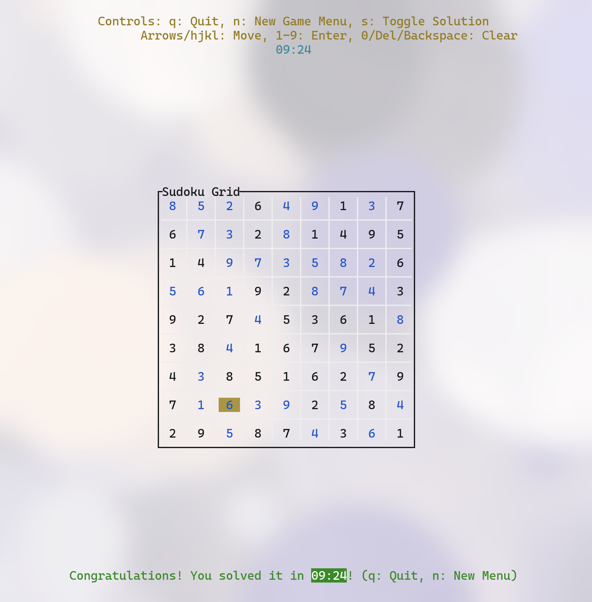

# TUI Sudoku

A simple Sudoku game playable in your terminal, built with Rust using the `ratatui` and `crossterm` libraries.

## Features

*   **Difficulty Levels:** Choose between Easy, Medium, and Hard difficulties, affecting the number of pre-filled cells.
*   **Terminal UI:** A clean interface built with `ratatui`.
*   **Keyboard Controls:** Full control using keyboard inputs.
*   **Mouse Support:** Click on cells to select them.
*   **Input Validation:** Invalid moves are highlighted (Red number).
*   **Solution Toggle:** View the complete solution.
*   **Timer:** Tracks your time while playing.
*   **Win Detection:** Displays a congratulatory message upon solving the puzzle.



## Controls

*   **Difficulty Selection Screen:**
    *   `Up Arrow / k`: Move selection up
    *   `Down Arrow / j`: Move selection down
    *   `Enter`: Start game with selected difficulty
    *   `q`: Quit
*   **Game Screen:**
    *   `Arrow Keys / h, j, k, l`: Move cursor
    *   `1-9`: Enter number in selected cell
    *   `0 / Delete / Backspace`: Clear selected cell
    *   `s`: Toggle solution view
    *   `n`: Return to the New Game (Difficulty Selection) menu
    *   `q`: Quit
    *   `Mouse Click`: Select cell

## How to Run

1.  **Clone this repository then cd into it:**
    ```bash
    cd tui_sudoku 
    ```
2.  **Build and run:**
    ```bash
    cargo run
    ```
    Or, for an optimized build:
    ```bash
    cargo run --release
    ```

## Dependencies

This project relies on the following main Rust crates:

*   `ratatui` (and its `crossterm` backend) for the terminal user interface.
*   `rand` for shuffling and puzzle generation. 